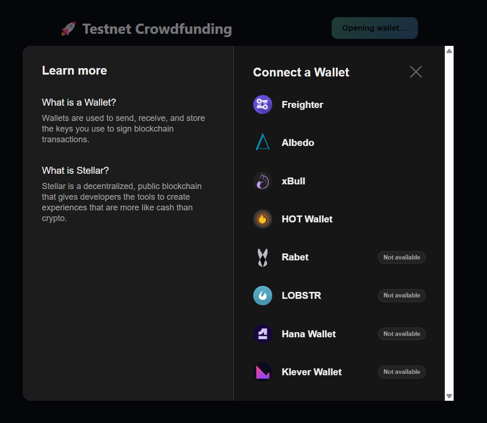

# 🚀 Testnet Crowdfunding — Stellar Yellow Belt Submission

A tiny crowdfunding dApp built on Soroban (Stellar's smart contract platform). Connect any supported wallet, donate testnet XLM toward a funding goal, and watch the progress bar and activity feed update live as donations come in.

I built this for the **Yellow Belt** level — the goal was to get comfortable with multi-wallet support, deploying a real contract, calling it from a frontend, and wiring up event-driven updates instead of just refreshing on a timer for the sake of it (though I do also poll, more on that below).

## What it does

- Pick a wallet (Freighter, xBull, Albedo, Lobstr, Hana...) through one unified modal — no per-wallet integration code.
- Donate XLM to a campaign contract deployed on Soroban testnet.
- See the transaction go from "building" → "pending" → "success/fail" in real time.
- Watch the progress bar and a live donor feed update automatically, driven by contract events (`donate` emits a `donation` event that the frontend listens for via `getEvents`).
- Get clear, human error messages instead of raw RPC errors when something goes wrong.

## What reviewers should see

A reviewer should be able to:
1. Connect a Stellar wallet on Testnet.
2. Enter an amount and approve a donation.
3. See the campaign progress and activity feed update from the deployed contract.

## Stack

- **Contract:** Rust + `soroban-sdk` (v21)
- **Frontend:** React + TypeScript + Vite
- **Wallets:** [`@creit.tech/stellar-wallets-kit`](https://github.com/Creit-Tech/StellarWalletsKit)
- **Chain access:** `@stellar/stellar-sdk` talking to the public Soroban testnet RPC

## Project structure

```
contracts/
  crowdfunding/
    src/lib.rs        # the contract: initialize / donate / withdraw / get_info
    src/test.rs        # unit tests (donate + withdraw happy path)
frontend/
  src/lib/wallet.ts    # StellarWalletsKit wrapper + error normalisation
  src/lib/contract.ts  # build/sign/submit txs, read state, poll events
  src/components/      # WalletConnect, DonationForm, ProgressBar, ActivityFeed
  src/App.tsx
```

## Errors handled

| Error | Where | What the user sees |
|---|---|---|
| Wallet not found / not installed | Connecting a wallet | "No compatible wallet was found. Please install Freighter, xBull, or another supported wallet." |
| User rejects the signing request | Donating | "You rejected the request in your wallet." |
| Insufficient balance | Donating | "Insufficient balance to complete this donation." |

## Getting it running

### 1. Prerequisites

- [Rust](https://rustup.rs/) + the `wasm32-unknown-unknown` target
- [Stellar CLI](https://developers.stellar.org/docs/tools/cli/install-cli) (`stellar` command) — this replaced the old `soroban` CLI
- Node.js 18+
- A wallet browser extension for testing, e.g. [Freighter](https://www.freighter.app/), set to **Testnet**

```bash
rustup target add wasm32-unknown-unknown
```

### 2. Build & deploy the contract

```bash
cd contracts/crowdfunding
stellar contract build

# Create/fund a deployer identity if you don't have one yet
stellar keys generate deployer --network testnet --fund

# Deploy — copy the contract id this prints out
stellar contract deploy \
  --wasm target/wasm32-unknown-unknown/release/crowdfunding.wasm \
  --source deployer \
  --network testnet
```

Then initialize the campaign (goal is in stroops — 1 XLM = 10,000,000 stroops, so 500 XLM = 5000000000):

```bash
# Find the native XLM token's contract id on testnet
stellar contract id asset --asset native --network testnet

stellar contract invoke \
  --id <YOUR_CONTRACT_ID> \
  --source deployer \
  --network testnet \
  -- initialize \
  --owner <YOUR_DEPLOYER_PUBLIC_KEY> \
  --goal 5000000000 \
  --token <NATIVE_XLM_CONTRACT_ID>
```

### 3. Run the frontend

```bash
cd frontend
cp .env.example .env
# paste your contract id + the native token id into .env
npm install
npm run dev
```

Open `http://localhost:5173`, connect a testnet wallet, and donate 🎉

## Deployed contract

- **Contract ID:** `CBTUNIZMFD7RUVCNK2RTEAPRVHH5VQLKWSNWFERBHVAE64QSNHVS5353`
- **Deployed by (public key):** `GCGUOKRFNR775ZC2CN3ZZGL67ZW47TKUSCE5FHVHGNPZIMM2G2O4T4SI`
- **Explorer link:** https://stellar.expert/explorer/testnet/contract/CBTUNIZMFD7RUVCNK2RTEAPRVHH5VQLKWSNWFERBHVAE64QSNHVS5353

## Example transaction

- **Tx hash:** `c5b8445d1b5ce20359d6dfc47b85e87c2077b8dd62551335fdc2628204e3e4c8`
- **Explorer link:** https://stellar.expert/explorer/testnet/tx/c5b8445d1b5ce20359d6dfc47b85e87c2077b8dd62551335fdc2628204e3e4c8

## Screenshot: wallet options



## Notes / things I'd improve with more time

- Event polling uses a 5s interval against public RPC — fine for a demo, but a dedicated indexer (or Soroban's upcoming subscription APIs) would be more robust for anything beyond testnet.
- `withdraw` is implemented and tested but there's no UI for it yet since only the campaign owner can call it.
- No backend — everything talks directly to Soroban RPC from the browser.

## License

MIT — do whatever you want with it.
